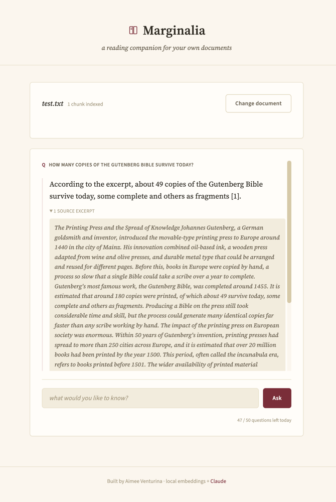
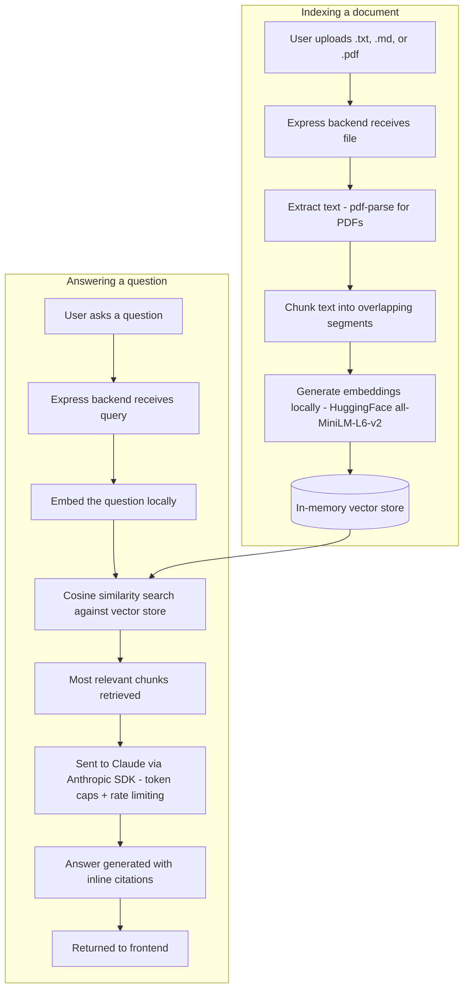

# Marginalia

A reading companion for your own documents. Upload a file, ask questions about it, and get answers grounded in what the document actually says, with the exact source excerpts cited inline, not a guess from memory. I built it to be cheap to run and safe to leave public: the embedding and retrieval side runs entirely on a small local model at no cost, and only the final answer goes through the Claude API, with hard spending limits in place.



**Live site:** [doc-chat-fdzl.onrender.com](https://doc-chat-fdzl.onrender.com)

## Features

- Upload a `.txt`, `.md`, or `.pdf` file (up to 5MB)
- Text is chunked, embedded locally, and stored in memory as a simple vector index
- Ask questions in a chat interface; answers are generated by Claude using only the most relevant retrieved excerpts
- Every answer shows which source excerpts it was grounded in
- A daily request limit protects against a public demo running up a real API bill

## RAG, in plain terms

If you're not familiar with retrieval-augmented generation (RAG), here's the short version: instead of asking Claude to answer a question from memory, this app first finds the exact paragraphs in your uploaded document that are relevant to your question, then hands Claude only those paragraphs along with your question. Claude can then only answer from what's actually in front of it, not from a guess, which is why every answer can point back to the specific source excerpt it came from.

## Tech stack

**Frontend**
- Vanilla JavaScript, hand-written CSS
- [Parcel](https://parceljs.org/) for bundling and the dev server

**Backend**
- Node.js + Express
- [`@huggingface/transformers`](https://huggingface.co/docs/transformers.js): local embedding model (`all-MiniLM-L6-v2`), runs in-process with no API key or per-call cost
- In-memory vector store with cosine similarity search (no database, documents live for the server's lifetime, which is fine for a demo)
- [`@anthropic-ai/sdk`](https://www.npmjs.com/package/@anthropic-ai/sdk) (Claude) for the actual answer generation, the only step that costs money per call
- `pdf-parse` for PDF text extraction

## Architecture

The app has two main flows, both handled by the same Express backend. Indexing happens when a document is uploaded: the text is chunked, embedded with a small local model, and stored in memory, all for free, with no external API call. Querying is where Claude comes in: the question is embedded locally too, matched against the stored chunks, and only the most relevant excerpts are sent to Claude to generate the final answer. That split keeps every step free except the one that actually needs a strong language model. Both flows are shown below.





## Why local embeddings?

Embeddings and generation are different problems. This app uses a small local model for embeddings (free, runs on CPU, no external call) and reserves the paid Claude API for the one step that actually needs a strong language model: generating the answer. That keeps the cost surface to a single API, and keeps the app fully testable without needing a live key (see Testing below).

## Keeping API costs under control

Two layers:

1. **Provider-level hard spending cap.** Set a hard monthly limit on the API key itself in the [Anthropic console](https://console.anthropic.com/). This is the real safety net, it holds even if the app-level logic below has a bug.
2. **App-level limits.** `max_tokens` is capped on every Claude request, and a daily request counter (`DAILY_REQUEST_LIMIT`, default 50) returns a friendly "limit reached" message instead of letting requests through unbounded.


## Limitations and what's next

This is a demo, and a few trade-offs reflect that:

- Documents are stored in memory, not in a database, so they disappear when the server restarts. That's fine for trying it out, but not for anything you'd want to keep around.
- There's no user accounts or document separation between visitors to the live demo, everyone shares the same daily request limit and the same in-memory store.
- Retrieval is based on similarity search over the whole document. There's no re-ranking or more advanced retrieval strategy layered on top.

If I kept building this, the next steps would be swapping the in-memory store for a persistent vector database, adding per-user sessions so documents don't leak between visitors, and adding a re-ranking step to improve retrieval quality on longer documents.


## Getting started

**Prerequisites:** Node.js and an API key from [console.anthropic.com](https://console.anthropic.com/).

```bash
git clone https://github.com/aventurina/doc-chat.git
cd doc-chat
npm install
```

Create a `.env` file (see `.env.example`):

```
ANTHROPIC_API_KEY=your_anthropic_api_key_here
```

Then run both the API server and the frontend dev server together:

```bash
npm start
```

This opens the app at `http://localhost:1234`, with `/api/*` proxied to the Express server on port `4003`.

## Testing

```bash
npm test
```

The test suite mocks both the embedding model and the Claude client, so it runs fully offline (no model download, no API key, no cost) while still exercising the real chunking, retrieval, and rate-limiting logic.

## Deployment

Run `npm run build` to generate `dist/`, then start the server with `npm run server`. Express serves the built frontend and the API from the same origin. Set `ANTHROPIC_API_KEY` (and optionally `DAILY_REQUEST_LIMIT`) as environment variables on whatever platform hosts it. Needs a persistent Node process (not a serverless function) since documents are held in memory between requests.

## Project structure

```
index.html                Markup and layout
css/style.css             Light, editorial "reading room" theme
js/scripts.js             Upload flow, chat UI, usage indicator
server/index.js           Express app: upload, chat, usage, health routes
server/embeddings.js      Local embedding model wrapper
server/chunk.js           Text chunking with overlap
server/store.js           In-memory vector store + cosine similarity
server/claude.js          Claude client wrapper (context injection, max_tokens cap)
server/rateLimit.js       Daily request limiter
server/*.test.js          Tests for each module, run with Node's built-in test runner
```
